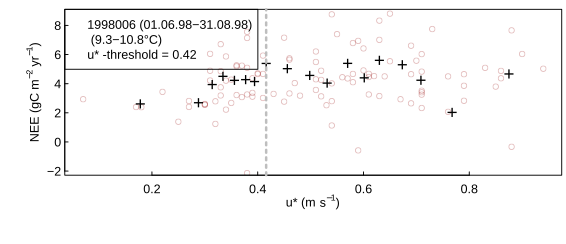

```{r setup, include = FALSE}
knitr::opts_chunk$set(
    #, fig.align = "center"
    #, fig.width = 3.27, fig.height = 2.5, dev.args = list(pointsize = 10)
    #,cache = TRUE
    #, fig.width = 4.3, fig.height = 3.2, dev.args = list(pointsize = 10)
    #, fig.width = 6.3, fig.height = 6.2, dev.args = list(pointsize = 10)
    # works with html but causes problems with latex
    #,out.extra = 'style = "display:block; margin: auto"' 
    )
knitr::knit_hooks$set(spar = function(before, options, envir) {
    if (before) {
        par(las = 1 )                   #also y axis labels horizontal
        par(mar = c(2.0,3.3,0,0) + 0.3 )  #margins
        par(tck = 0.02 )                          #axe-tick length inside plots             
        par(mgp = c(1.1,0.2,0) )  #positioning of axis title, axis labels, axis
     }
})
```

```{r, include = FALSE, warning = FALSE}
#themeTw <- theme_bw(base_size = 10) + theme(axis.title = element_text(size = 9))
#bgiDir <- "~/bgi"
```

## Pre-note

Slides are provided at
https://github.com/bgctw/EGU19EddyCourse/tree/master/StandardProcessing

## Three main processing step 

for carbon fluxes

- uStar threshold estimation
- gapfilling
- flux partitioning

## Say hello to the REddyProc class

R6 object-oriented design

- feed your data to this class 
- tell it ancillary information and parameters
- ask it to compute interesting stuff, i.e. fluxes and its uncertainties

typical R users have to get used to it, because its a different
philosophy compyred to a collection of functions.

## A day in the life of EProc {.smaller}

- initialize the class with your data table, and tell time zone and geo-location
```{r eval=FALSE, message=FALSE}
EProc = sEddyProc$new(...)
EProc$sSetLocationInfo(LatDeg = 51.0, LongDeg = 13.6, TimeZoneHour = 1)  
```
- ask it to estimate the conditions suitable for the EC method -> u* threshold
```{r eval=FALSE, message=FALSE}
EProc$sEstUstarThold(...)
```
- ask it to model the missing or filtered data -> gapfilling
```{r eval=FALSE, message=FALSE}
EProc$sMDSGapFill(...)
```
- ask it to compute gross fluxes GPP and REco -> flux partitioning
```{r eval=FALSE, message=FALSE}
EProc$sMRFluxPartition(...)
```
- ask it to provide the result data or write it to file
```{r eval=FALSE, message=FALSE}
EProc$sExportResults()
```

## But: $u_*$ is uncertain
```{r eval=FALSE, include=FALSE}
EProc2 <- sEddyProc$new(
  'DE-Tha', EddyDataWithPosix, c('NEE','Rg','Tair','VPD', 'Ustar'))
uStarTh <- EProc2$sEstUstarThold()
# may plot saturation of NEE with UStar for a specified season to pdf
EProc2$sPlotNEEVersusUStarForSeason(levels(uStarTh$season)[3], format = "png")
```


At low friction velocity ($u_*$) the NEE is biased low. Threshold detection
estimates the $u_*$ above with there is no bias. 

The threshold is uncertain. 

- discarding to few periods -> NEE biased low
- discarding to many periods -> slightly biased high and larger uncertainty

Bias propagates to GPP and REco - what threshold to choose?

## Therefore: Repeat processing with many thresholds

```{r eval=FALSE, message=FALSE}
EProc$<processingStep>UStarScens(...)
```

produces several output columns with the $u_*$-threshold scenario
appended as a suffix.

- `NEE`: no $u_*$ filtering
- `NEE_uStar`: filtered for low $u_*$, threshold estimated with original data
- `NEE_U50`: filtered for low $u_*$, threshold is the 50% quantile of all 
  the estimated threshold with bootstrapped data


## Evaluate distribution of outcomes across scenarios

```{r eval=FALSE, message=FALSE}
mean(mydata$NEE_U05, mydata$NEE_U10, ..., mydata$NEE_U95)

sd(mydata$NEE_U05, mydata$NEE_U10, ..., mydata$NEE_U95))

plot(NEE_annual ~ uStarThreshold_quantile)
```

## 

