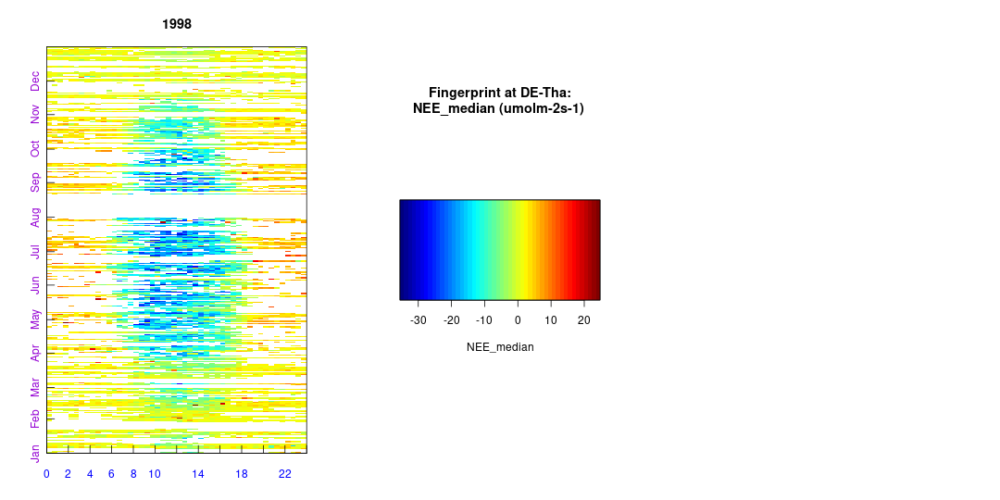

```{r setup, include = FALSE}
knitr::opts_chunk$set(
    #, fig.align = "center"
    #, fig.width = 3.27, fig.height = 2.5, dev.args = list(pointsize = 10)
    #,cache = TRUE
    #, fig.width = 4.3, fig.height = 3.2, dev.args = list(pointsize = 10)
    #, fig.width = 6.3, fig.height = 6.2, dev.args = list(pointsize = 10)
    # works with html but causes problems with latex
    #,out.extra = 'style = "display:block; margin: auto"' 
    )
knitr::knit_hooks$set(spar = function(before, options, envir) {
    if (before) {
        par(las = 1 )                   #also y axis labels horizontal
        par(mar = c(2.0,3.3,0,0) + 0.3 )  #margins
        par(tck = 0.02 )                          #axe-tick length inside plots             
        par(mgp = c(1.1,0.2,0) )  #positioning of axis title, axis labels, axis
    }

})
```

## Motivation
```{r echo=FALSE}
library(REddyProc)  
EProc = local({load("StandardProcessing_uStar.RData"); get(ls()[1])})  
```
The filtering for low $u_*$ introduced gaps in the NEE data. 
In order to compute annual sums, these must be filled with estimated fluxes.



## Lookup tables (LUT)

Fluxes are expected similar if they are

- at similar environmental conditions 
    - Rg $\pm$ 50 $W m^{-2}$, Tair $\pm$ 2.5 $°C$, and VPD $\pm$ 5.0 $h Pa$
- and close in time 
    - increasing time window until enough observations

Such LUT windows are used to compute 

    - mean (NEE_<uStar>_f) and
    - and standard deviation (NEE_<uStar>_fsd).

The variation in fluxes is assumed to represent random error.

## Mean diurnal course (MDC)

Fluxes are expected similar if they are

- at the same time of the day ($\pm$ 1 hour)
- not too many days away

## Marginal distribution sampling

Combines LUT and MDC

Quality flag increases with fewer variables and larger time windows

   - 0 Observations
   - 1 gap-filled with good quality
   - $>1$ gap-filled with lower quality

## Perform the gapfilling
One needs to specify the variable, i.e. column which should be filled.

```{r gapfill, message = FALSE}
EProc$useAnnualUStarThresholds() # use annual u* threshold estimates
EProc$sMDSGapFillUStarScens('NEE')
```

The screen output (not shown here) already shows that the $u_*$-filtering and
gap-filling was repeated for each given estimate of the $u_*$ threshold
, i.e. column in 
`uStarThAnnual`, with marking 22% to 38% of the data as gap. 

## Inspect the outputs
For each of the different $u_*$ threshold estimates
a separate set of output columns of filled NEE and its 
uncertainty is generated, distinguished by the suffixes given with 
`uStarSuffixes`. <Suffix>"_f" denotes the filled value and "_fsd" the 
estimated standard deviation of its uncertainty.

```{r grepf, results = 'hold' }
grep("NEE_.*_f$",names(EProc$sExportResults()), value = TRUE)
grep("NEE_.*_fsd$",names(EProc$sExportResults()), value = TRUE)
```

## Inspect the outputs
A fingerprint-plot of one of the new variables shows that gaps have been filled.
```{r FP, echo=TRUE}
EProc$sPlotFingerprintY('NEE_U50_f', Year = 1998)
```


```{r eval=FALSE, include=FALSE}
# interactively save data for later use
save(EProc, file = "StandardProcessing_gapfill.RData")
#ds <- cbind(EddyData, season = EProc$sExportResults())
#fWriteDataframeToFile(ds, "DETha98_uStar.txt")
```


