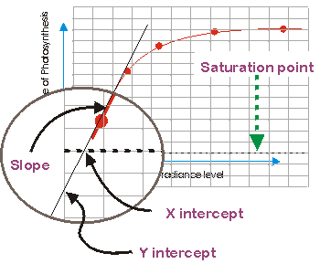

```{r setup, include = FALSE}
knitr::opts_chunk$set(
    #, fig.align = "center"
    #, fig.width = 3.27, fig.height = 2.5, dev.args = list(pointsize = 10)
    #,cache = TRUE
    #, fig.width = 4.3, fig.height = 3.2, dev.args = list(pointsize = 10)
    #, fig.width = 6.3, fig.height = 6.2, dev.args = list(pointsize = 10)
    # works with html but causes problems with latex
    #,out.extra = 'style = "display:block; margin: auto"' 
    )
knitr::knit_hooks$set(spar = function(before, options, envir) {
    if (before) {
        par(las = 1 )                   #also y axis labels horizontal
        par(mar = c(2.0,3.3,0,0) + 0.3 )  #margins
        par(tck = 0.02 )                          #axe-tick length inside plots             
        par(mgp = c(1.1,0.2,0) )  #positioning of axis title, axis labels, axis
    }
})
```


# Background
## Motivation
```{r echo=FALSE}
library(REddyProc)  
EProc = local({load("StandardProcessing_gapfill.RData"); get(ls()[1])})  
#EProc$sApplyUStarScen
```

NEE is net flux of two gross fluxes. IThe third post-processing step is partitioning the net flux (NEE) into its gross 
components $GPP$ and $R_{eco}$.

$$
NEE = R_{eco} - GPP
$$

Nighttime-Partitioning
:   estimate $R_{eco} \sim T$ relationship of nighttime NEE (where $GPP = 0$)

Daytime-Partitioning
:   fit a model of $NEE$ to global radiation, VPD and temperature.

## Sort records to Daytime and  Nighttime

The partitioning needs to distinguish carefully between night-time and day-time
records. 

classified as nighttime, if

1. Threshold of $Rg < 10\, W m^{-2}$
2. Daytime between compute times of sunrise and sunset

# Nighttime flux partitioning
## Temperature sensitivity: $E_0$

Respiration is modelled by eq. of Lloyd & Tayler (1994)

$$
R_{eco}(T; R_{Ref}, E_0) = R_{Ref} \, \text{exp} \left[ E_0  \left( \frac{1}{T_{Ref}-T_{0}} -
\frac{1}{T-T_{0}} \right) \right]
$$
where $T_0 = -46.02°C$ and Reference temperature $T_{Ref} = 15°C$. 

Temperature sensitivity, $E_0$, is fitted to successive 15-day periods
on trimmed data.

Annually aggregated, $E_0$ is then the mean across valid estimates where 
1) there were at least six records, 
2) temperate ranged across at least 5°C, 
and 3)
estimates were inside range of 30 to 450K.

## Respiration at reference temperature: $R_{Ref}$

Respiration at reference temperature, $R_{Ref}$, is
re-estimated from nighttime data 

- using the annual $E_0$ temperature sensitivity
estimate 
- for 7-day windows shifted consecutively for 4 days. 

Then its assigned to the central time-point of the 4-day period and linearly
interpolated between periods. 

Hence, the obtained respiration-temperature 
relationship varies across time.

## Gross fluxes: $R_ {eco}$ and $GPP$

$$
R_ {eco} = f(T; R_{Ref}(t), E_0)
$$
$$
GPP = NEE - R_ {eco}
$$
Note that variation in NEE can lead to negative $GPP$:

If predicted $R_{eco} > NEE$ then predicted $GPP < 0$. 

# Daytime flux partitioning

## Light response curve (LRC)


## Fitting the Light responce curve (LRC)

The method of Lasslop (2010) models $NEE$:

$$
NEE = -GPP(Rg, VPD; \alpha, \beta_0, k) + R_{eco}(T; R_{Ref}, E_0)
$$
$$
GPP = \frac{\alpha \beta R_g}{ \alpha R_g + \beta}
$$
$$
\beta = \begin{cases}
\beta_0 \, \text{exp} \left[ -k (\operatorname{VPD} - \operatorname{VPD}_0) 
\right] 
\text{ if VPD > 10 hPa} \\
\beta_0 \text{ otherwise}
\end{cases}
$$

$\alpha$ ($\mu mol \, CO_2 \, J^{-1}$) is the canopy light
utilization efficiency and represents the initial slope of the light-response
curve, 

$\beta$ ($\mu mol\, CO_2\, m^{-2} s^{-1}$) is the maximum 
CO2 uptake rate of the canopy at infinite Rg, which is
a decreasing function at higher VPD values.

## Temperature sensitivty
Temperature sensitivity, $E_0$ is estimated from night-time data and provided
to the day-time LRC fit to avoid parameter identifyability problems.

Different from the nigh-time partitioning a smoothed time varying estimate is
used instead of the annual aggregate. And during $E_0$ estimation, reference 
temperature $R_{Ref}$ is set to the median temperature of the time window.

## LRC parameters and Reference temperature $R_{Ref}$
Are fitted using only daytime data and the previously
determined temperature sensitivity ($E_0$) for each shifting window 
across records.

## Gross fluxes: $R_{eco}$ and $GPP$

Are predcted by the LRC and Lloyd & Taylor respiration for each central record
of the shifting window.

Results are linearly interpolated by the difference to the window centers.

Lasslop 2010

:    Daytime estimates of reference temperatures are also used
     for predicting nighttime $R_{eco}$ 

Keenan 2019

:    Nighttime estiamtes of reference temperatures (obtained with the $E_0$ fits)
     are used for predicting nighttime $R_{eco}$ 

## Caution Partitioning is not always applicable
Partitioning only works if there is a good $R_{eco} \sim T$ relationship.

It is not applicable if either there is

- Suppressed respiration at freezing temperatures
- Limited variation of temperature
- Strong controls of other factors such as moisture


# Flux Partitioning in REddyProc
## Preparations
Specify geographical coordinates and time zone. 

Fill mssing values in the used meteorological data. 

```{r, message = FALSE}
EProc$sSetLocationInfo(LatDeg = 51.0, LongDeg = 13.6, TimeZoneHour = 1)  
EProc$sMDSGapFill('Tair', FillAll = FALSE,  minNWarnRunLength = NA)     
EProc$sMDSGapFill('VPD', FillAll = FALSE,  minNWarnRunLength = NA)     
EProc$sMDSGapFill('Rg', FillAll = FALSE,  minNWarnRunLength = NA)     
```

## Nighttime partitioning

Repeated for each of the $u_*$ threshold scenario 
(percentiles of $u_{*Th}$ distribution)
```{r partNight, message = FALSE, warning = FALSE}
EProc$sMRFluxPartitionUStarScens()
grep("GPP|Reco",names(EProc$sExportResults()), value = TRUE)
```

It produces output columns `Reco_<uStar>` and `GPP_<uStar>_f` modified by the respective 
$u_*$ threshold suffix in the REddyProc class.

`GPP_<uStar>_fqc > 1` denotes bad quality for windows where valid parameter estimates are further away.

## Fingerprint plots of Nighttime $R_{eco}$ and $GPP$

```{r, message=FALSE}
EProc$sPlotFingerprint('GPP_U50_f', Dir = "plots", Format = "png")
EProc$sPlotFingerprint('Reco_U50', Dir = "plots", Format = "png")
```
$GPP$  | $R_{eco}$
-|-
 |  

## Daytime partitioning

```{r eval=FALSE, include=FALSE}
  EProc$trace(sApplyUStarScen, recover); # EProc$untrace(sApplyUStarScen)
  ftmp = function(suffix=NA){
    recover()
    suffix
  } 
  tmp = EProc$sApplyUStarScen(ftmp)
```

Repeated for each of the $u_*$ threshold scenario 
(percentiles of $u_{*Th}$ distribution)
```{r partDay, message = FALSE, warning = FALSE}
invisible(EProc$sGLFluxPartitionUStarScens())
grep("GPP.*_DT|Reco.*_DT",names(EProc$sExportResults()), value = TRUE)
```

It produces output columns `Reco_DT_<uStar>` and `GPP_DT_<uStar>` modified by the respective 
$u_*$ threshold suffix in the REddyProc class.

`_SD` denotes the standard deviation of the prediction error.

## Fingerprint plots of Daytime $R_{eco}$ and $GPP$

```{r, message=FALSE}
EProc$sPlotFingerprint('GPP_DT_U50', Dir = "plots", Format = "png")
EProc$sPlotFingerprint('Reco_DT_U50', Dir = "plots", Format = "png")
```
$GPP$  | $R_{eco}$
-|-
 |  


## Save the results
So far the results are stored internally in the REddyProc class.
Get them as a data.frame:
```{r include=FALSE}
#EddyData <- fLoadTXTIntoDataframe("DETha98.txt")
```

```{r}
results = EProc$sExportResults()
# bind to original original data
appResults = cbind(EProc$sExportData(), results)
# save to tab-separated file
fWriteDataframeToFile(appResults, "DETha98_proc.txt") 
```


```{r eval=FALSE, include=FALSE}
# interactively save data for later use
save(EProc, file = "StandardProcessing_fluxpart.RData")
#ds <- cbind(EddyData, season = EProc$sExportResults())
#fWriteDataframeToFile(ds, "DETha98_uStar.txt")
```


