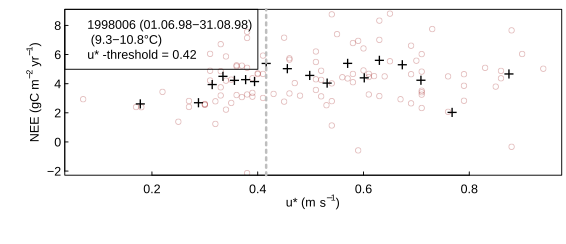

```{r setup, include = FALSE}
knitr::opts_chunk$set(
    #, fig.align = "center"
    #, fig.width = 3.27, fig.height = 2.5, dev.args = list(pointsize = 10)
    #,cache = TRUE
    #, fig.width = 4.3, fig.height = 3.2, dev.args = list(pointsize = 10)
    #, fig.width = 6.3, fig.height = 6.2, dev.args = list(pointsize = 10)
    # works with html but causes problems with latex
    #,out.extra = 'style = "display:block; margin: auto"' 
    )
knitr::knit_hooks$set(spar = function(before, options, envir) {
    if (before) {
        par(las = 1 )                   #also y axis labels horizontal
        par(mar = c(2.0,3.3,0,0) + 0.3 )  #margins
        par(tck = 0.02 )                          #axe-tick length inside plots             
        par(mgp = c(1.1,0.2,0) )  #positioning of axis title, axis labels, axis
     }
})
```

```{r, include = FALSE, warning = FALSE}
#themeTw <- theme_bw(base_size = 10) + theme(axis.title = element_text(size = 9))
#bgiDir <- "~/bgi"
```

## Importing the half-hourly data
```{r inputData, eval=FALSE, include=FALSE, spar=TRUE}
#+++ load libraries used in this vignette
library(REddyProc)
library(dplyr)
#+++ Load data with 1 header and 1 unit row from (tab-delimited) text file
fileName <- getExamplePath('Example_DETha98.txt', isTryDownload = TRUE)
EddyData0 <- if (length(fileName)) fLoadTXTIntoDataframe(fileName) else
  # or use example dataset in RData format provided with REddyProc
  Example_DETha98
#+++ Replace long runs of equal NEE values by NA
EddyData0 <- filterLongRuns(EddyData0, "NEE")
#write.table(EddyData0,"DETha98.csv", sep = "\t", row.names = FALSE)
fWriteDataframeToFile(EddyData0, "DETha98.txt")
```

Reads a text file with data of the year 1998 from the Tharandt site.

```{r}
library(REddyProc)
EddyData <- fLoadTXTIntoDataframe("DETha98.txt")
```

## Example Data
```{r}
head(EddyData)
```

## Initializing the REddyProc class
```{r}
# create R timestamp from columns Year, DoY and Hour
EddyDataWithPosix <- fConvertTimeToPosix(
  EddyData, 'YDH',Year = 'Year',Day = 'DoY', Hour = 'Hour')
EProc <- sEddyProc$new(
  'DE-Tha', EddyDataWithPosix, c('NEE','Rg','Tair','VPD', 'Ustar'))
EProc$sSetLocationInfo(LatDeg = 51.0, LongDeg = 13.6, TimeZoneHour = 1)
```
## Getting help: "?"
```{r echo=TRUE}
# display overview help of REddyProc
?REddyProc  

# display help of a specific function
?fConvertTimeToPosix

# display help of a method of the REddyProc class
# prepend by 'sEddyProc_'
?sEddyProc_sEstimateUstarScenarios
```


## Problem: NEE biased low at low u*
```{r eval=FALSE, include=FALSE}
EProc2 <- sEddyProc$new(
  'DE-Tha', EddyDataWithPosix, c('NEE','Rg','Tair','VPD', 'Ustar'))
uStarTh <- EProc2$sEstUstarThold()
# may plot saturation of NEE with UStar for a specified season to pdf
EProc2$sPlotNEEVersusUStarForSeason(levels(uStarTh$season)[3], format = "png")
```


At low frction velocity ($u_*$) the NEE is biased low. Threshold detection
estimates the $u_*$ above with there is no bias. Discarding periods with low uStar 
is one of the largest sources of uncertainty in aggregated fluxes.

## Estimating the uStar threshold distribution
The estimate of the $u_*$ theshold is uncertain. Hence, several quantiles of the distribution of the uncertain uStar threshold are estimated by a bootstrap.

The friction velocity, uStar, needs to be in column named "Ustar" of the input 
dataset. 

```{r, message = FALSE}
EProc$sEstimateUstarScenarios(
    nSample = 20L, probs = c(0.05, 0.5, 0.95))
```

## Inspect the estimated $u_*$ threshold
```{r}
(uStarTh <- EProc$sGetEstimatedUstarThresholdDistribution())
```

## Effects on gap coverage

With increasing $u_*$ threshold, the fraction of records that are marked as gaps increases.
Hence, all the gappfilling, flux-partitioning, and aggregation need to by repeated
for diffrent $u_*$ threshold estimates.

```{r fpNEEUStar, include = FALSE, eval = FALSE}
uStarScen = signif(unlist(uStarTh[1,4:7]),2)
EProc$sDATA$NEE_low <- EProc$sDATA$NEE_median <- EProc$sDATA$NEE_orig <- 
  EProc$sDATA$NEE_upper  <- EProc$sDATA$NEE
EProc$sDATA$NEE_orig[ EProc$sDATA$Ustar < uStarScen["uStar"] ] <- NA
EProc$sDATA$NEE_low[ EProc$sDATA$Ustar < uStarScen["5%"]] <- NA
EProc$sDATA$NEE_median[ EProc$sDATA$Ustar < uStarScen["50%"]] <- NA
EProc$sDATA$NEE_upper[ EProc$sDATA$Ustar < uStarScen["95%"]] <- NA
# need to produce fingerprints by hand in console - if exeucted from chunk it does not safe a pdf
EProc$sPlotFingerprint('NEE_orig', Dir = "plots", Format = "png")
EProc$sPlotFingerprint('NEE_low', Dir = "plots", Format = "png")
EProc$sPlotFingerprint('NEE_median', Dir = "plots", Format = "png")
EProc$sPlotFingerprint('NEE_upper', Dir = "plots", Format = "png")
EProc$sDATA$NEE_median <- EProc$sDATA$NEE_orig <- 
  EProc$sDATA$NEE_low <- EProc$sDATA$NEE_upper <- NULL
```


low $u_*$ threshold  | medium  $u_*$ threshold  | high  $u_*$ threshold  
-|-|-|-
 |  |  
```{r include=FALSE}
#:-------------------------:|:-------------------------:|:-------------------------:
#  |  | 
```


## Aggregating threshold estimates

There threshold may change across time. Hence, there is an estimate for different
time periods, i.e. seasons. To be conservative, by default gapfilling uses the annually aggregated values.

```{r, message = FALSE}
EProc$sGetUstarScenarios()
```


## Using seasonal estimates
One can use seasonal estimates, instead of the annual aggregates.

EProc$sGetUstarScenarios()
```{r}
EProc$useSeaonsalUStarThresholds()
EProc$sGetUstarScenarios()
```


## User-defined seasons

The default seasons are (Dec,Jan,Feb) (Mar,Apr,Mai) (Jun,Jul,Aug) and (Sep,Oct,Nov).
If you know at which dates the surface roughness changes, e.g. with harvest
you can tell the seasonal breakes.

```{r}
seasonStarts <- data.frame( c(70,210,320), 1998 )
seasonFactor <- usCreateSeasonFactorYdayYear(
  EddyDataWithPosix$DateTime - 15*60, starts = seasonStarts)
#EProc$sEstimateUstarScenarios(
#   seasonFactor = seasonFactor
#   nSample = 100L, probs = c(0.05, 0.5, 0.95))
```


```{r eval=FALSE, include=FALSE}
# interactively save data for later use
save(EProc, file = "StandardProcessing_uStar.RData")
#ds <- cbind(EddyData, season = EProc$sExportResults())
#fWriteDataframeToFile(ds, "DETha98_uStar.txt")
```

